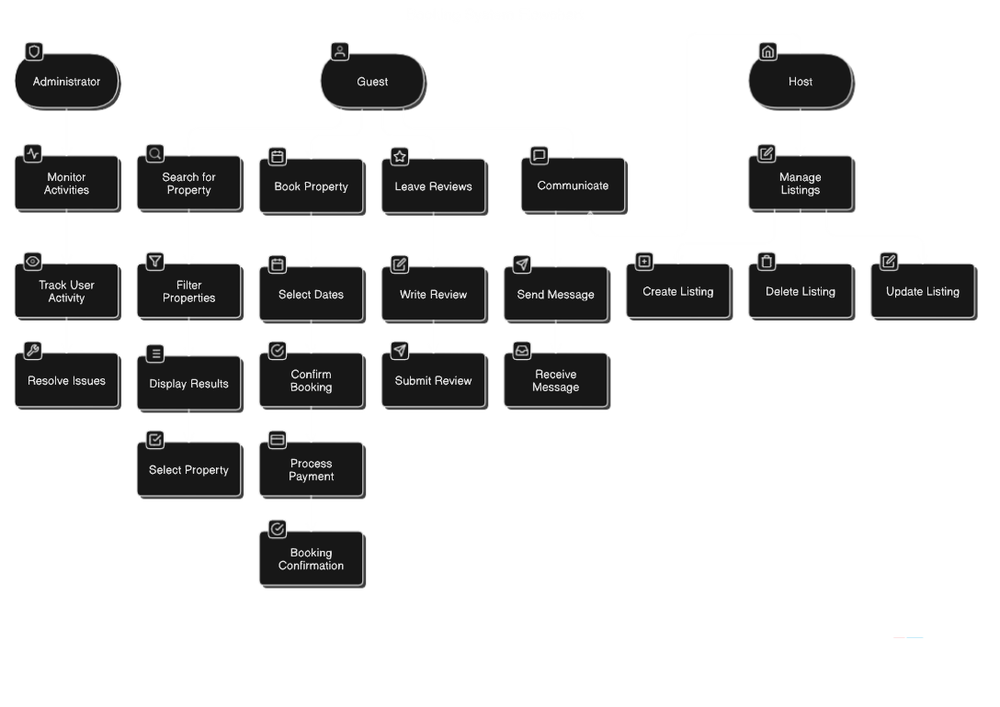

# Requirement Analysis in Software Development

## Introduction  
This repository, **Requirement Analysis**, serves as a comprehensive guide and reference for documenting, analyzing, and structuring requirements in software development. The focus of this project is to create a detailed blueprint of the requirement analysis phase for a booking management system.  

By simulating a real-world development scenario, this repository emphasizes clarity, precision, and structure in defining requirements. It is designed to set a strong foundation for successful project execution, equipping learners with the skills to translate user needs into actionable system specifications.  

Feel free to explore the tasks, methodologies, and deliverables outlined here to gain insights into the crucial role of requirement analysis in software development.

## What is Requirement Analysis?

**Requirement Analysis** is a critical phase in the Software Development Lifecycle (SDLC) that focuses on identifying, gathering, and documenting the specific needs and expectations of stakeholders for a software system. This phase serves as the foundation for the entire development process, ensuring that the final product aligns with the users' requirements and business objectives.

### Key Activities in Requirement Analysis:
1. **Gathering Requirements**:
   - Engaging with stakeholders through interviews, surveys, and workshops.
   - Identifying functional requirements (what the system should do) and non-functional requirements (performance, security, etc.).

2. **Analyzing Requirements**:
   - Evaluating requirements for feasibility, clarity, and consistency.
   - Prioritizing requirements based on business goals and constraints.

3. **Documenting Requirements**:
   - Creating formal documentation such as:
     - Software Requirement Specification (SRS).
     - User stories, use cases, and process diagrams.

4. **Validating Requirements**:
   - Ensuring the requirements accurately reflect stakeholder needs.
   - Confirming alignment with project objectives and technical constraints.

### Importance of Requirement Analysis in SDLC:
1. **Prevents Misunderstandings**:
   - Clearly defined requirements reduce ambiguities and misunderstandings between stakeholders and developers.

2. **Guides the Development Process**:
   - Acts as a roadmap for the design, development, and testing phases.

3. **Saves Time and Resources**:
   - Identifying issues early avoids costly corrections later in the development lifecycle.

4. **Ensures Stakeholder Satisfaction**:
   - Delivering a product that meets user needs fosters trust and satisfaction.

5. **Facilitates Testing and Validation**:
   - Well-documented requirements provide clear benchmarks for quality assurance.

By focusing on clarity, precision, and stakeholder involvement, Requirement Analysis ensures that the software development process is well-structured and goal-oriented, setting the stage for successful project execution.

## Why is Requirement Analysis Important?

Requirement Analysis is a cornerstone of the Software Development Lifecycle (SDLC). It ensures that the software being developed meets the needs and expectations of stakeholders while staying within scope, time, and budget constraints. Below are three key reasons why Requirement Analysis is critical:

### 1. **Prevents Misunderstandings and Misalignment**  
   - Requirement Analysis provides a clear and shared understanding of what the software must achieve among all stakeholders, including clients, developers, and testers.  
   - Without this clarity, projects may suffer from scope creep, where new or unapproved features are added, leading to delays and increased costs.  
   - A well-documented set of requirements acts as a reference point throughout the development process.

---

### 2. **Reduces Costs and Development Time**  
   - Identifying and addressing potential issues during the Requirement Analysis phase is significantly less expensive than fixing problems during later stages, such as development or testing.  
   - By clearly defining requirements upfront, teams can avoid unnecessary work, rework, and confusion, saving both time and resources.  
   - Efficient allocation of resources based on well-documented requirements ensures smooth progress through subsequent phases.

---

### 3. **Enhances Stakeholder Satisfaction**  
   - A software product that fulfills its intended purpose and meets user expectations builds trust and satisfaction among stakeholders.  
   - Requirement Analysis ensures that stakeholder needs are understood and prioritized, making the end product more likely to be accepted and successful.  
   - It also minimizes the risk of delivering a product that is misaligned with business goals or user requirements.

---

By emphasizing clarity, accuracy, and thoroughness during the Requirement Analysis phase, teams can lay a strong foundation for successful software development, ensuring that the project meets its objectives efficiently and effectively.

## Key Activities in Requirement Analysis

The Requirement Analysis phase involves several critical activities to ensure that all stakeholder needs are accurately captured, documented, and validated. Below are the five key activities involved:

### 1. **Requirement Gathering**  
   - Identify and collect initial information about the project goals, objectives, and expectations.  
   - Engage with stakeholders, such as clients, users, and business managers, to understand their needs.  
   - Use tools and techniques like interviews, surveys, and brainstorming sessions to gather data.  

---

### 2. **Requirement Elicitation**  
   - Actively extract detailed requirements through direct interaction with stakeholders.  
   - Use advanced techniques such as workshops, focus groups, prototyping, and observation to uncover implicit needs.  
   - Address conflicting or unclear requirements by collaborating with stakeholders to resolve ambiguities.  

---

### 3. **Requirement Documentation**  
   - Organize and record gathered requirements in a structured and clear format.  
   - Create formal documents such as the Software Requirement Specification (SRS), user stories, or functional requirement documents.  
   - Ensure that the documentation is complete, unambiguous, and accessible to all stakeholders.  

---

### 4. **Requirement Analysis and Modeling**  
   - Analyze the gathered requirements to ensure they are feasible, realistic, and aligned with project goals.  
   - Use modeling techniques like flowcharts, use case diagrams, or data flow diagrams to represent requirements visually.  
   - Prioritize requirements based on business value, technical complexity, and stakeholder input.  

---

### 5. **Requirement Validation**  
   - Review the documented requirements with stakeholders to confirm they accurately reflect their needs and expectations.  
   - Conduct validation sessions such as peer reviews, walkthroughs, or prototyping demonstrations.  
   - Ensure that requirements are testable and measurable, setting the stage for successful development and testing.  

---

Each of these activities plays a vital role in ensuring that the software development process begins with a strong and accurate foundation, reducing risks and enhancing the chances of project success.

# Types of Requirements

In the context of a booking management system, such as those for Airbnb or OYO, requirements can be categorized into **Functional** and **Non-Functional Requirements**. Each type plays a vital role in defining what the system must do and how it should operate.

## Functional Requirements

Functional requirements describe the core functionalities and behavior of the system. They focus on **what the system should do** to meet the users' needs.

### Examples for a Booking Management System:
- **User Authentication:**  
  Users must be able to register and log in using various methods, including email, social media platforms, or Single Sign-On (SSO).  
- **Search Functionality:**  
  The system should allow users to search for properties using filters such as location, price range, amenities, and availability.  
- **Booking Process:**  
  Users should be able to select booking dates, confirm details, and securely make payments.  
- **Communication:**  
  Provide a messaging feature enabling direct communication between guests and hosts.  
- **Cancellation and Refunds:**  
  Support cancellation policies and automate refund processes based on predefined rules.  

---

## Non-Functional Requirements

Non-functional requirements define the quality attributes and operational aspects of the system. They focus on **how the system performs its functions** and address broader performance goals.

### Examples for a Booking Management System:
- **Performance:**  
  Pages must load in under 3 seconds, even during peak user traffic.  
- **Scalability:**  
  The system must support thousands of concurrent users without performance degradation.  
- **Data Security:**  
  Ensure compliance with regulations like GDPR and PCI DSS to protect user data and transactions.  
- **Availability:**  
  Guarantee 99.9% uptime, minimizing maintenance downtime.  
- **User-Friendliness:**  
  Provide an intuitive interface for a seamless user experience across devices.  

---

## Importance of Categorizing Requirements

Understanding and documenting both functional and non-functional requirements ensures the system is designed to meet user expectations while delivering high performance and reliability. A well-balanced approach to both types of requirements lays a strong foundation for project success.

## Use Case Diagrams

### What Are Use Case Diagrams?
Use Case Diagrams are visual representations of the interactions between actors (users or external systems) and the functionalities (use cases) of a system. They help to illustrate how different users will engage with the system, providing a high-level view of its functionality.

### Benefits of Use Case Diagrams
- **Simplifies Complex Systems:** Provides a clear and concise way to understand and communicate the functionalities of the system.
- **Facilitates Requirement Analysis:** Helps in identifying and documenting system requirements effectively.
- **Enhances Stakeholder Communication:** Serves as a bridge between technical teams and stakeholders, ensuring everyone has a shared understanding of the system's goals.
- **Supports System Design:** Acts as a foundation for detailed system design and development.

### Use Case Diagram for the Booking Management System
Below is a use case diagram that highlights the interactions between the actors (Guest, Host, and Administrator) and the use cases in the booking management system.

### Key Components:
- **Actors:**
  - **Guest:** Interacts with the system to search for properties, book stays, leave reviews, and communicate with hosts.
  - **Host:** Manages property listings, communicates with guests, and handles bookings.
  - **Administrator:** Oversees platform operations, user management, and system maintenance.
- **Use Cases:**
  - **Search for Property:** Allows guests to find properties using filters.
  - **Book Property:** Enables guests to make bookings and process payments.
  - **Manage Listings:** Allows hosts to create, update, or delete property details.
  - **Communicate:** Facilitates messaging between guests and hosts.
  - **Leave Reviews:** Guests can share feedback about their stays.
  - **Monitor Activities:** Administrators can track platform activities and resolve issues.

This diagram provides a high-level overview of the functionalities and interactions, offering valuable insights for both development and stakeholder collaboration.

